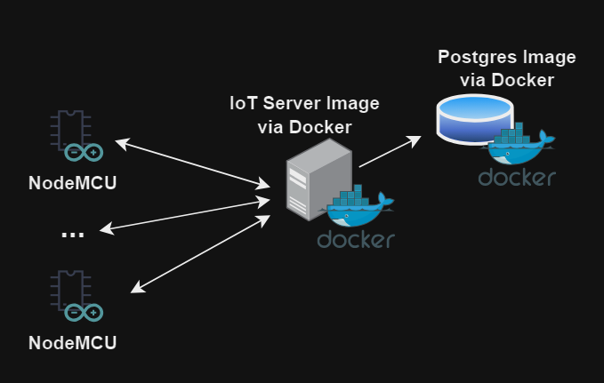
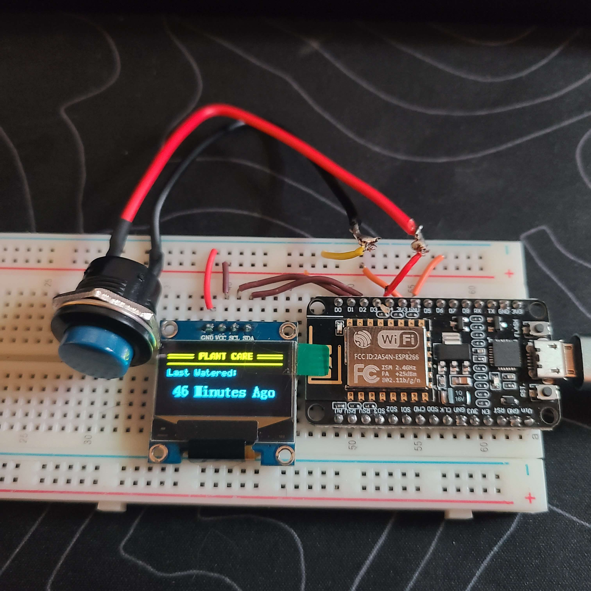

## Project
The aim is to build a network of IoT devices designed around a simple button input to mark when household tasks are accomplished. Phase 1 will be a simple server-client relationship for the nodeMCU devices, where I press a button and it results in adding a row to the database for the current device's most recent activity as a timestamp.

## Organization
The `Server` runs on a docker container, that talks to the database located on another container where the database is run. It waits for requests from IoT devices on the network. The server is a simple `Express.js` HTTP node.js server for now, but will eventually feed data into a web app that aggregates all data stored on the `postgres` database.

These devices are built on the `NodeMCU` platform. They're using ESP8266 libraries to communicate with the central server. Each one has a LCD to display information, and a button to trigger a method to send an HTTP request.

## Example Iot Device

(This is an early version!)
## Components

### NodeMCU (ESP8266)
- On start, the client setups a few libraries and pings the server for last known button press, as well as an NTP server for the current timestamp. The client will then periodically fetch the current timestamp through NTP and update time. 

### LCD (SD1306)
- Uses graphics libraries to display time difference of last retrieved timestamp (via NTP server) and last known button pressed.
- Connected SCL D1. Connect SDA D2. 

### Button 
- Connected to D4 and ground.
- Code runs a loop waiting for action on this button, when pressed it sends an HTTP PUT request to the server to input a new timestamp for when the button was pressed.
- I used an arcade button for fun, anything would have worked.